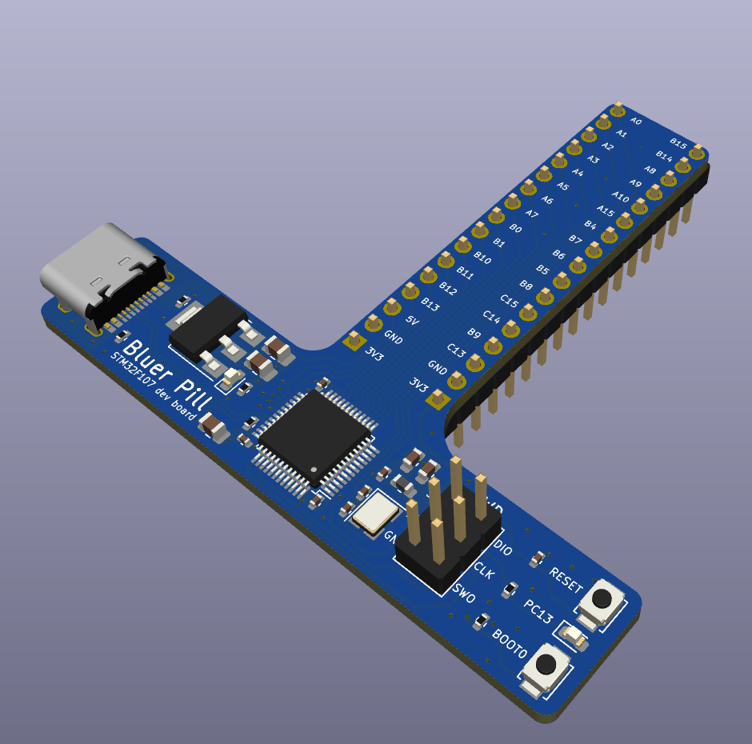

Blue pill like STM32F103 dev board made to practice PCB design in KiCad following some Phil's lab tutorial.
 
# Things to improve
I am pretty happy with the schematic, but the routing on the board could definitly use quite some work.
I definitly underestimated the amount of signals that needed to go to the headers.

The board could probably have been designed as a two layer board as well.

